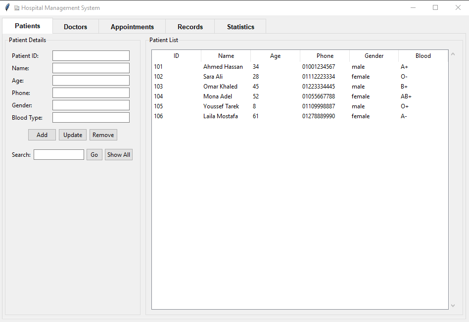
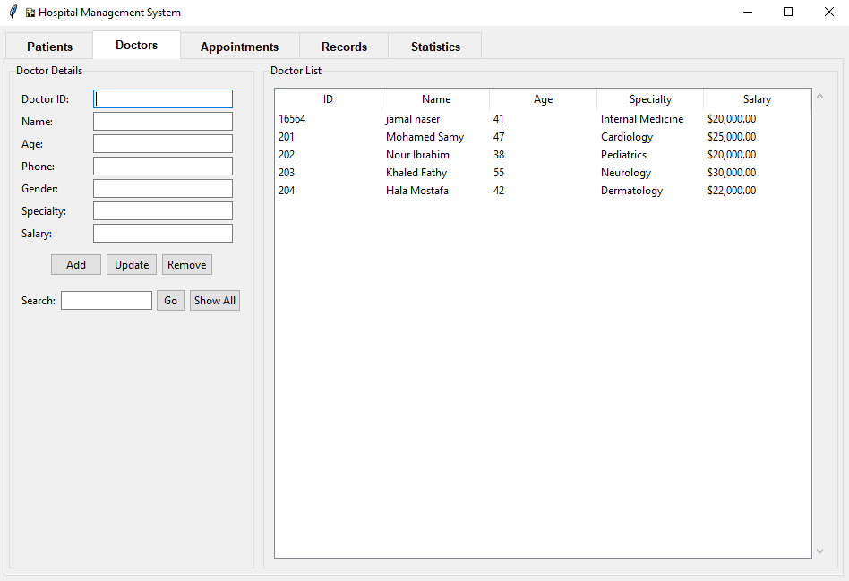
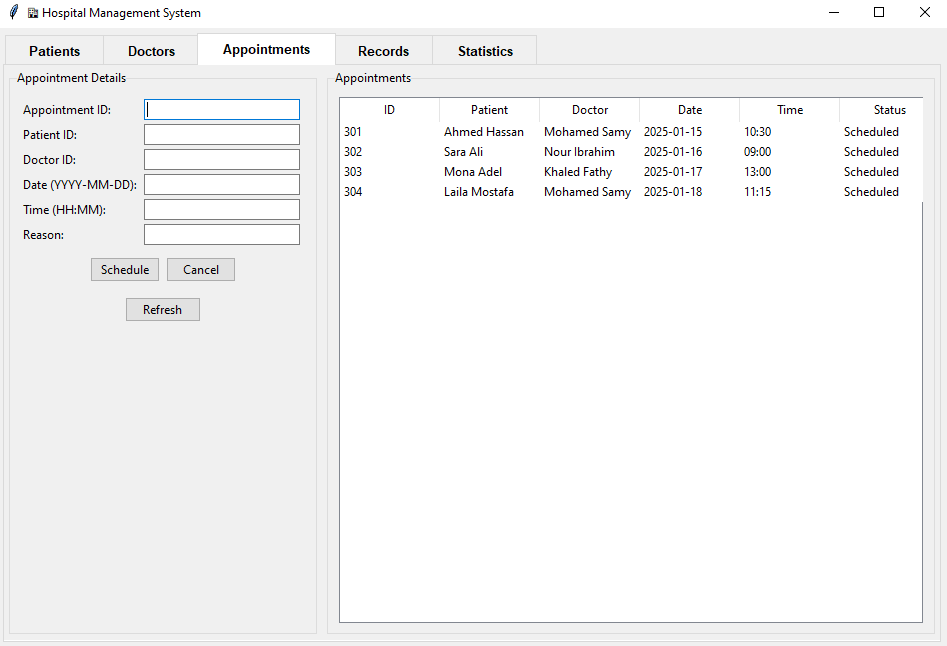
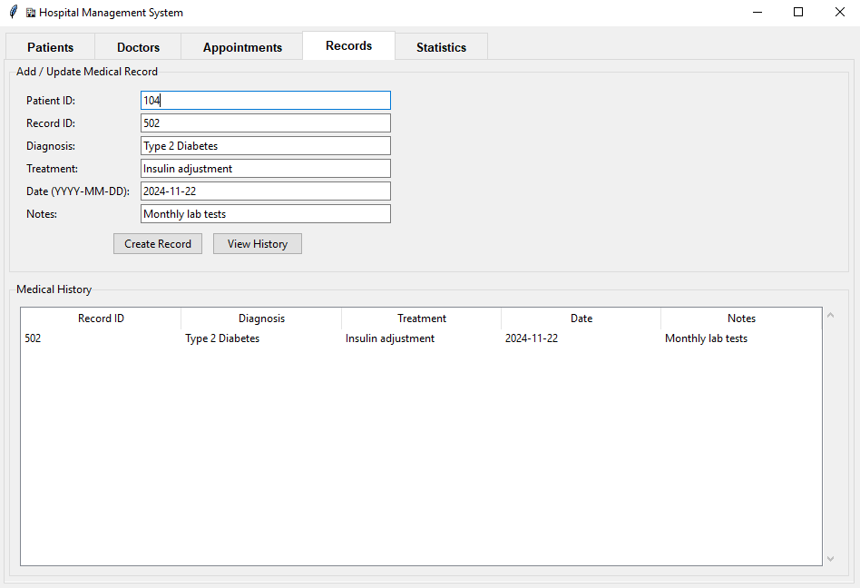
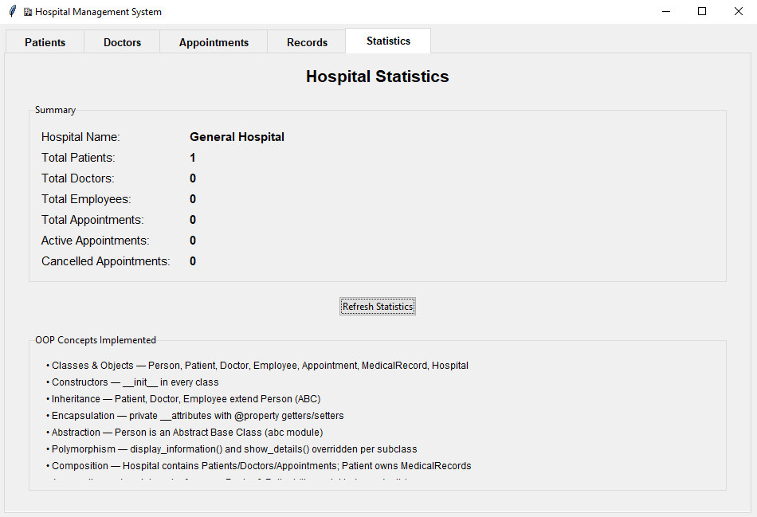

# hospital-management-system
Hospital Management System with Python (Tkinter GUI)

## 🏥 Hospital Management System
A complete desktop application for managing hospital operations —patients, doctors, appointments, and medical records — with a cleanand user-friendly graphical interface, built entirely in Python.


## 📌 Project Overview
This system helps hospital staff manage daily operations through asimple, organized interface instead of manual paperwork.

The project follows a layered architecture that separates the GUI,business logic, and data models — making the code clean and easy to maintain.


## ✨ Features

👩🏻‍💼 Patient Management — add, update & manage patient records

👨‍⚕️ Doctor Management — manage doctors' information & specializations

📅 Appointments — book and manage patient appointments

📋 Medical Records — store and browse patients' medical records

📊 Statistics Dashboard — visual overview of hospital activity

💾 Data Persistence — all data is saved automatically in JSON storage


## 📸 Screenshots


	




## 🛠 Tools & Technologies
|Technology|	Purpose|
|----------|---------|
|`Python`|	Core application logic|
|`Tkinter`|	Graphical User Interface|
|`JSON`|	Data persistence|


## 📂 Project Structure

|File|	Description|
|----|-------------|
|`main.py`|	Application entry point|
|`gui/main_window.py`|	Main window & navigation tabs|
|`gui/patient_frame.py`|	Patients tab — add, update, remove & search|
|`gui/doctor_frame.py`|	Doctors tab — manage doctors|
|`gui/appointment_frame.py`	|Appointments tab — schedule & cancel appointments|
|`gui/records_frame.py`|	Records tab — create & view medical history|
|`gui/stats_frame.py`|	Statistics tab — hospital summary & OOP overview|
|`models/person.py`	|Abstract base class (OOP inheritance root)|
|`models/patient.py`|	Patient class|
|`models/doctor.py`|	Doctor class|
|`models/employee.py`|	Employee class|
|`models/appointment.py`|	Appointment class|
|`models/medical_record.py`	|MedicalRecord class|
|`services/hospital.py`|	Business logic & data management|
|`exceptions/custom_exceptions.py`|	Custom exception classes|
|`utils/helpers.py`|	Helper & validation functions|
|`images`|	GUI screenshots|


## 🚀 How to Run
```
1-Clone the repository:
git clone https://github.com/abrarma01/hospital-management-system.git

2-Run the application: python main.py

3-No external libraries required — built with the Python Standard Library.
```


## 💡 Future Improvements

🔐 Login system with user roles (admin, doctor, receptionist)

🗄️ Upgrade storage to SQLite database

🔔 Appointment reminders
